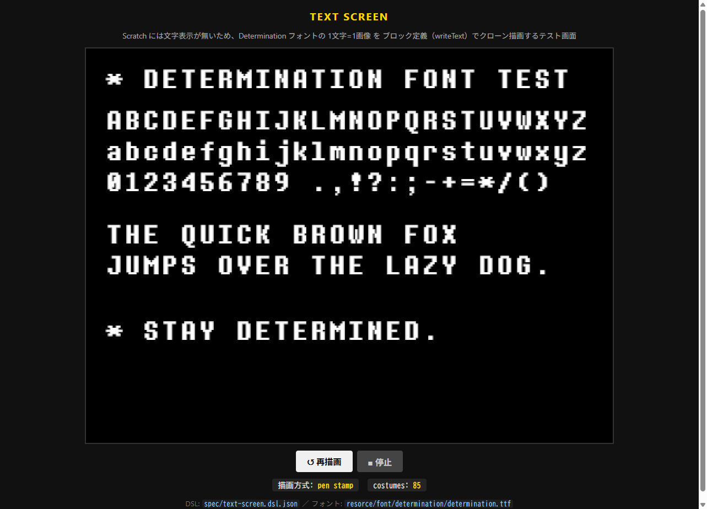

# htmlJs2sb3 — Scratch互換ランタイムシステム

Scratch 互換の最小サブセットを HTML/JS で実装し、**中間DSL（JSON）を唯一の正本**として
① ブラウザ上の Web 実行系（engine）と ② Scratch 3.0 `.sb3` 生成系（tools）の両方を
同じソースから導出する「型（システム）」。内部座標は Scratch 標準の 480×360 固定、
表示拡大は CSS のみ。

> このブランチ（`scratch-system`）は音ゲー部分（判定・譜面・ノーツ生成）を取り除き、
> Scratch互換ランタイムと DSL→sb3 変換だけを残した構成です。
> 音ゲー一式は `main` ブランチにあります。

- 実装の正本（DSL / モジュールAPI / opcode対応表）: [`CONTRACT.md`](./CONTRACT.md)
- 設計レポート: [`claudedocs/REPORT.md`](./claudedocs/REPORT.md)

## ディレクトリ

| ディレクトリ | 内容 |
|---|---|
| `spec/` | DSL 正本（`scratch-rhythm.dsl.json`）|
| `engine/` | Scratch風ランタイム（変数/リスト/イベント/スレッド/クローン/描画/音）。中核は Node でもヘッドレス動作 |
| `tools/` | DSL→sb3 変換（`generate-sb3` / `pack-sb3`）・DSL検証（`generate-web`）・静的配信（`serve`）|
| `web/` | ブラウザ用デモ（`index.html`=ランタイム実行 / `text-screen.html`=文字描画テスト画面）|
| `resorce/font/determination/` | Determination フォント本体と、そこから生成した1文字ごとのグリフPNG（`glyphs/`）|
| `tests/` | `node --test` 用テスト |

## 実装している Scratch ブロック（カテゴリ）

動き / 見た目 / 音 / イベント / 制御 / 調べる / 演算 / 変数 / リスト / ブロック定義。
詳細な opcode 対応は `CONTRACT.md` §2/§3/§6。

## 使い方

```bash
# テスト
node --test

# DSL → sb3 project.json
node tools/generate-sb3.js spec/scratch-rhythm.dsl.json dist/project.json

# DSL + assets → .sb3（zip）。実アセット未配置時はプレースホルダを合成
node tools/pack-sb3.js spec/scratch-rhythm.dsl.json dist/scratch-rhythm.sb3

# Web デモを配信 → http://localhost:8123/web/index.html
node tools/serve.js 8123
```

Web デモは「緑の旗」で DSL を実行。サンプル DSL では Note スプライトがクローンされ落下し、
broadcast / clone / motion / variables の実行を可視化する。実アセットが無くても動作する
（Renderer はプレースホルダ描画、SoundBridge は無音フォールバック）。

## 文字描画（Determination フォント）

Scratch には文字列を画面に表示するブロックが無い（`say` の吹き出しのみ）。そこで
**1文字=1コスチューム（画像）** とし、**ブロック定義（カスタムブロック）`writeText`** が文字列を
1文字ずつ **Pen の stamp** で焼き付ける方式で文字描画を実現している（クローンを使わないので
クローン数上限300の影響を受けない）。

- フォント `resorce/font/determination/determination.ttf` から英大文字・小文字・数字・簡単な記号の
  グリフを 1文字ずつ PNG 化（`resorce/font/determination/glyphs/cXXXX.png`、XXXX=コードポイント16進）。
- `Glyph` スプライトが各文字を同名コスチュームとして持ち、`writeText(text, x, y)` が
  `letter i of text` でコスチュームを切替え→位置へ移動→`penStamp` でその文字を焼き付ける、を繰り返す。
  描画開始時に `penClear` で前回分を消す。
- テスト画面 DSL は `spec/text-screen.dsl.json`。`web/text-screen.html` で表示。
- Pen 機能（`penClear`/`penStamp`/`penDown`/`penUp`/`penSetColor`/`penSetSize`/`penChangeSize`）は
  engine の `PenCompat`（pen レイヤを Renderer が背景の上に合成）で実装し、`.sb3` 変換でも
  `pen_*` opcode と `"extensions":["pen"]` に対応している。

```bash
node tools/serve.js 8123
# → http://localhost:8123/web/text-screen.html （Determination フォントの文字描画テスト画面）

# 表示文字列を変えたら DSL を再生成（既存グリフPNGから）
node tools/build-text-screen.mjs
```

グリフPNG自体を作り直す場合のみ、ブラウザで `determination.ttf` を `FontFace` 読込→canvas描画→
`toDataURL` した結果を `tools/_glyphs.json` に保存してから `build-text-screen.mjs` を実行する
（手順は同スクリプト冒頭のコメント参照）。


