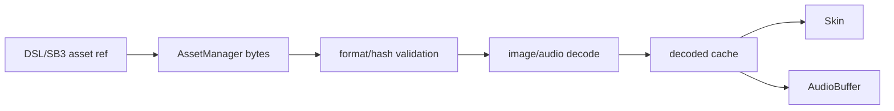

# Asset / Costume / Sound仕様

## Asset

`assetId`, `dataFormat`, `md5ext`, `kind`, `bytes`, `mimeType`, `source`, `status`を管理する。SB3内ファイル名は原則 `${assetId}.${dataFormat}`。公式serializerはruntime内の`md5`をproject.jsonの`md5ext`として出力する。

`scratch-storage@6.2.1` は `generateId=true` の新規assetでdataのMD5を`assetId`にする。P0もMD5を採用し、既存IDは保持する。`clean=false`は未保存assetを表す。

## Costume

| field | 仕様 |
|---|---|
| name | target内表示名 |
| assetId / md5ext / dataFormat | asset参照 |
| bitmapResolution | bitmap倍率。SVGにもserializer上存在し得る |
| rotationCenterX/Y | asset pixel座標の回転中心 |

SVGはsanitize/fixup後に描画用bitmapへ変換するが、保存時は元SVG bytesを保持する。bitmapはdecode後の画像と元bytesを分ける。

bitmapの論理サイズとrotation centerは`bitmapResolution`で除算してRendererへ渡す。公式Paintはbitmap resolution 2を標準とし、vector編集は内部960×720からexport時に0.5倍へ戻す。

## Sound

`name`, `assetId`, `md5ext`, `dataFormat`, `format`, `rate`, `sampleCount`。decode済みAudioBufferは派生cacheでありDSL/SB3へ保存しない。playback nodeはtargetごとに追跡する。

## 読込フロー

## Sound実行

simple play、play until done、stop all、target volumeをP0とする。pitch/panはP2、その他の音声効果はP3。

`scratch-audio@2.0.268`はnative `decodeAudioData`、ADPCM decoder、1-sample empty bufferの順でfallbackする。decode済みbufferからSoundPlayerを作り、Sprite単位SoundBankへ登録する。effect chainはpan → pitch → volumeの定義順で、pitchだけはaudio nodeではなくsourceのplayback rateを変更する。

AudioContextの開始は`startaudiocontext`を介し、ブラウザのuser gesture制約に従う。Loudnessは初回参照時にmicrophone許可を要求し、未接続時は-1、接続後は平滑化RMSを0..100へ変換する。

## Paintとの境界

Paint editorはP3。将来は編集結果としてbytes、dataFormat、rotation centerをAssetManagerへ渡す。`scratch-paint` 4.2.3の編集・export境界は確認済みだが、初期設計では直接依存しない。
