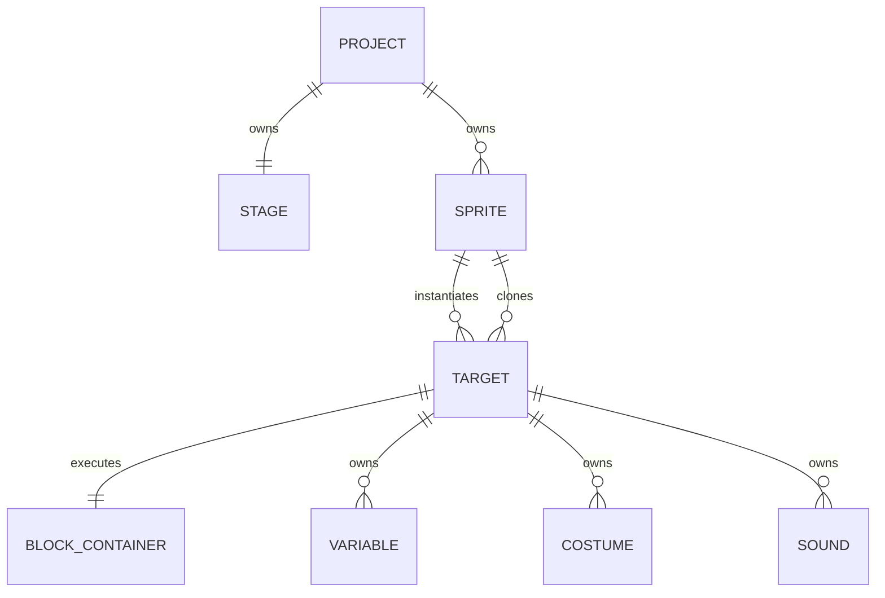

# Project / Target仕様

## エンティティ

公式では`Sprite`がcostumes/sounds/clones等の共有定義を持ち、`RenderedTarget`が位置・表示・現在コスチュームなど実行個体の状態を持つ。本DSLは保存しやすさを優先してSprite定義へまとめ、runtime構築時にdefinitionとinstanceへ分離する。

cloneはBlocks/costumes/sounds/sound bankを共有するが、変数値とedge-hat状態は生成時に複製して個別に保持する。

## Project

`name`, `stage`, `sprites`, `extensions`, `monitors`, `assets`, `meta`, `schemaVersion`。nameはSB3 project.json標準フィールドではないため、ファイル名またはDSLメタデータとして扱う。

## 共通Target

`id`, `isStage`, `name`, `variables`, `lists`, `broadcasts`, `blocks`, `comments`, `currentCostume`, `costumes`, `sounds`, `volume`, `layerOrder`。

## Stage固有

`tempo`, `videoTransparency`, `videoState`, `textToSpeechLanguage`。Stageは1個、target配列の先頭、`isStage: true`。座標・direction・draggableは持たせない。

## Sprite固有

`visible`, `x`, `y`, `size`, `direction`, `draggable`, `rotationStyle`。既定値は `(0,0)`, size 100, direction 90, visible true。rotationStyleは `all around`, `left-right`, `don't rotate`。

## Variable / List / Broadcast

| 種別 | フィールド | scope |
|---|---|---|
| Variable | `id,name,value,isCloud` | Stage=global、Sprite=local |
| List | `id,name,values[]` | Stage=global、Sprite=local |
| Broadcast | `id,name` | project共有。SB3ではStage側定義を基本とする |

cloud variableはP4。値はScratch互換cast層を通す。list indexの`last`/`random`/1-origin規則はBlock仕様で扱う。

## Clone

- cloneはoriginal Sprite定義を共有し、実行状態を複製した一時Targetである。
- SB3へclone個体は保存しない。
- `start as clone` hatsは生成直後にclone target上で起動する。
- deleteは関連threads、drawable、音、monitor参照を解放する。
- 公式 `Runtime.MAX_CLONES` は300。初期値300とし、テスト用には設定可能にする。
