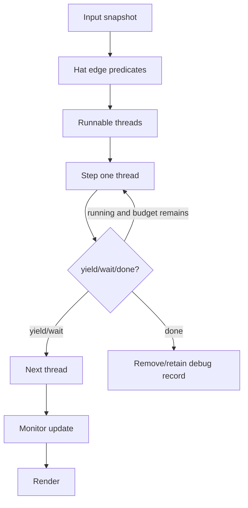

# Thread / Scheduler仕様

## Thread状態

公式 `Thread` で確認した状態を採用する。

| 状態 | 意味 |
|---|---|
| RUNNING | 実行可能 |
| PROMISE_WAIT | 非同期処理の完了待ち |
| YIELD | 同tick内で再開可能な明示yield |
| YIELD_TICK | 次tickまで待機 |
| DONE | 完了・停止 |

Threadは `topBlock`, `target`, `stack`, `stackFrames`, `status`, `warpTimer` を持つ。要求にあるtimerとprocedure contextはstack frameに保持する。

## Stack frame

`blockId`, `isLoop`, `warpMode`, `waitingReporter`, `executionContext`, `procedureCode`, `params`, `timer/deadline` を保持する。制御ブロックの反復回数やbranch位置をグローバル変数へ置かない。

## 1 tick

## 制御ブロック

- `repeat`: frameに残回数を保存し、SUBSTACKを反復。
- `forever`: SUBSTACK完了後に再開。tick境界を保証。
- `if/if else`: 条件cast後に一方のbranchをpush。
- `wait/wait until`: deadlineまたはpredicate成立までyield。
- `repeat until`: predicate falseの間branchを反復。
- stop all/this script/other scripts in spriteは対象thread集合を明示して停止。

## Warp

procedure mutationの`warp`を読み、procedure frameへ継承する。warpでもpromise待ちや明示的時間待ちは無視しない。公式Sequencer同様、長時間実行を防ぐtime sliceを設ける。

## 決定性

同一tickのthread順はtarget順とhat/script順に基づく安定順序とする。ただし公式Scratchと完全に同一の競合順序は保証しない。乱数は注入可能なRandomSourceを使い、テストでseed固定を可能にする。

