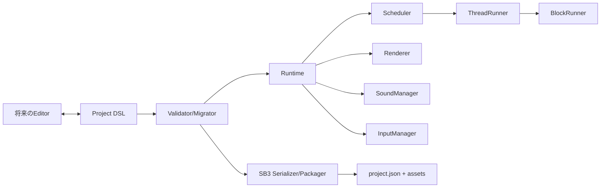

# 疑似Scratch基盤アーキテクチャ

## 方針

内部DSLを唯一の正本とし、Web RuntimeとSB3生成を別アダプタとして接続する。Scratch完全互換は名乗らず、確認済みのデータ形状と実行意味を段階的に採用する。

## モジュール

| モジュール | 責務 | 優先度 |
|---|---|---|
| Project / Stage / Sprite / Target | 永続モデルと実行個体 | P0 |
| BlockContainer / BlockRunner | block graph保持、opcode dispatch | P0 |
| Runtime / Scheduler / ThreadRunner | lifecycle、tick、thread状態遷移 | P0 |
| EventBus / BroadcastManager | hats起動、broadcast wait | P0 |
| VariableStore / ListStore | global/localデータと監視通知 | P0 |
| ~~Renderer / Drawable / Skin~~ | 削除済み。視覚は実 Scratch VM + scratch-render で実行 (`npm run preview`/`shot`) | — |
| Asset/Costume/Sound Manager | asset ID、decode、参照管理 | P0 |
| Input/Sensing Manager | keyboard、mouse、timer | P0 |
| CloneManager | clone生成・破棄・上限 | P1 |
| ProcedureManager | custom block、引数、warp | P1 |
| MonitorManager / PenLayer | watcherとpen合成 | P1 |
| SB3 Serializer/Packager | project.jsonとZIP | P0/P1 |
| SB3 Deserializer | 読込 | P2 |
| ProjectLoader/Saver | DSL永続化 | P0 |
| DebugOverlay/ErrorReporter | thread・opcode・asset診断 | P1 |

## 依存方向

- domain modelはDOM、Canvas、Web Audio、ZIPライブラリへ依存しない。
- runtimeはport (`RendererPort`, `AudioPort`, `ClockPort`, `InputPort`) のみに依存する。
- serializerはruntime内部状態ではなく正規化DSLを入力とする。
- editorはDSL commandを発行し、runtimeへ直接オブジェクトを注入しない。

## DSLの最上位

`schemaVersion`, `project`, `stage`, `sprites`, `assets`, `monitors`, `extensions`, `meta` を持つ。scriptはtop-level block IDを参照し、blocksはID辞書で `opcode`, `next`, `parent`, `inputs`, `fields`, `shadow`, `topLevel`, `x`, `y`, `mutation` を保持する。

## Validation境界

DSLはschema validationだけで実行可能とは判定しない。次の順で検証する。

1. JSON構造と`schemaVersion`。
2. ID形式とproject内一意性。
3. entity参照とvariable/list/broadcast scope。
4. block graphのparent/next/input整合性と循環。
5. opcode metadataに対するinput/field/shadow/target適合性。
6. procedure mutationとasset参照の意味検証。

Runtime、Editor、SB3 Serializerはvalidation済みのProjectだけを受け取る。検証回避用のraw object注入APIは公開しない。

## 非機能要件

- 内部Stageは常に480×360。CSS表示サイズは実行座標へ影響させない。
- IDはproject内で一意かつ安定。保存ごとの無条件再採番は禁止。
- 不明opcodeはロード時に保持し、実行時に診断付き停止またはno-op方針を明示する。
- project loadは検証後に一括commitし、中途半端なruntime状態を公開しない。
